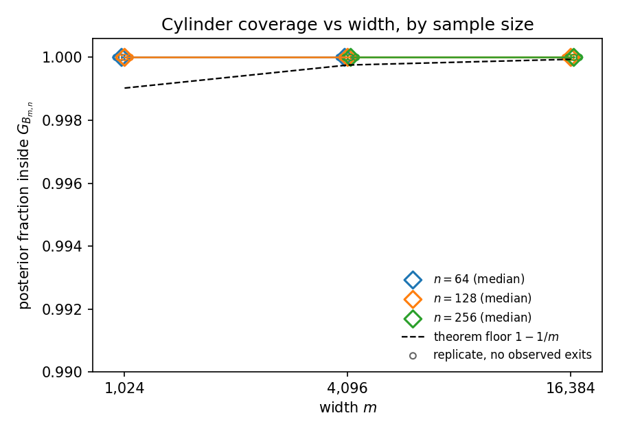
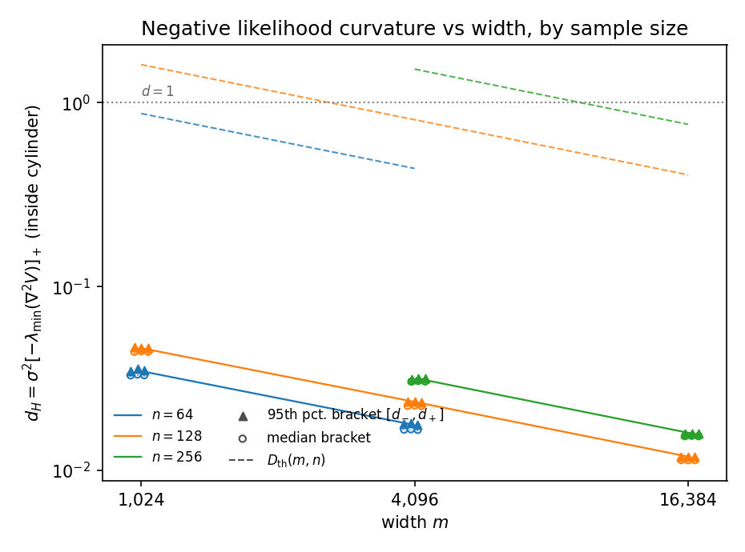
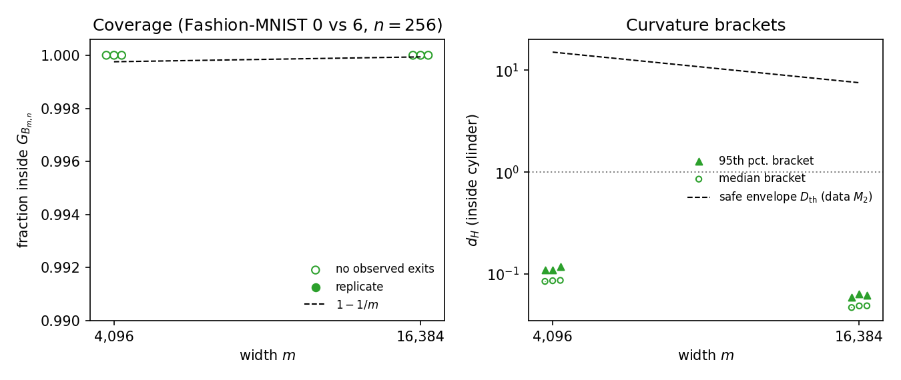
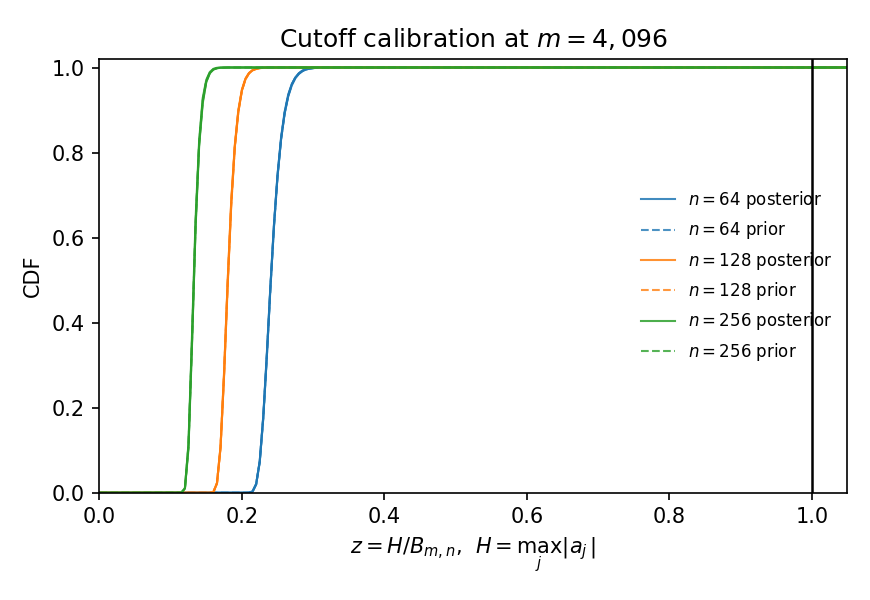

# Larger-sample extension results

Generated 2026-09-30T20:45:45+00:00 on `cc-login5.campuscluster.illinois.edu`, commit `4da16e6c63`, config `config.ext.yaml`.
Targets done: 27/27.

## Validation

| check | result |
|---|---|
| arrowhead_vs_dense | PASS |
| brackets_vs_dense_hessian | PASS |
| dense_bracket_matches_pilot | PASS |
| hessian_decomposition | PASS |
| matched_full_vs_reduced_sampling | PASS |
| matched_sampling_negative_control | PASS |
| reduction_exact | PASS |

## Settings (medians over replicates)

| data | n | m | n/√m | B | D_th | coverage (min) | exits | q99 H/B | median d₊ | q95 [d₋, d₊] | q95 d₊/D_th | between-rep SD | diag pass |
|---|---|---|---|---|---|---|---|---|---|---|---|---|---|
| fmnist | 256 | 4096 | 4 | 21.08 | 15.33 | 1 (1) | 0 | 0.156 | 0.0859 | [0.109, 0.11] | 0.00718 | 0.0048 | False |
| fmnist | 256 | 16384 | 2 | 21.11 | 7.677 | 1 (1) | 0 | 0.162 | 0.0486 | [0.0611, 0.0613] | 0.00799 | 0.0023 | False |
| orth | 64 | 1024 | 2 | 11.53 | 0.8731 | 1 (1) | 0 | 0.271 | 0.0329 | [0.0343, 0.035] | 0.04 | 0.00045 | True |
| orth | 64 | 4096 | 1 | 11.6 | 0.4389 | 1 (1) | 0 | 0.283 | 0.0167 | [0.0176, 0.0178] | 0.0406 | 0.0001 | True |
| orth | 128 | 1024 | 4 | 15.44 | 1.611 | 1 (1) | 0 | 0.202 | 0.0442 | [0.0449, 0.0462] | 0.0287 | 0.0002 | True |
| orth | 128 | 4096 | 2 | 15.49 | 0.8079 | 1 (1) | 0 | 0.212 | 0.0224 | [0.023, 0.0236] | 0.0292 | 0.0002 | True |
| orth | 128 | 16384 | 1 | 15.54 | 0.4051 | 1 (1) | 0 | 0.221 | 0.0114 | [0.0118, 0.0119] | 0.0293 | 2.2e-05 | True |
| orth | 256 | 4096 | 4 | 21.08 | 1.522 | 1 (1) | 0 | 0.156 | 0.0304 | [0.0306, 0.0315] | 0.0207 | 0.00015 | True |
| orth | 256 | 16384 | 2 | 21.11 | 0.7625 | 1 (1) | 0 | 0.162 | 0.0153 | [0.0156, 0.0159] | 0.0208 | 2.5e-05 | True |

## Targets

T beyond the addendum's retained-update cap (`sampling.protocol_max_retained`) is marked †. Limiting = observable with the lowest bulk ESS.

| target | status | T | diag pass | R̂ max | bulk ESS min | limiting | coverage | budget hit |
|---|---|---|---|---|---|---|---|---|
| orth_n128_m4096_r0 | done | 16000 | True | 1.004 | 1164 | V | 1 | False |
| orth_n128_m4096_r1 | done | 40000 † | True | 1.001 | 2620 | V | 1 | False |
| orth_n128_m4096_r2 | done | 16000 | True | 1.004 | 1028 | V | 1 | False |
| orth_n128_m1024_r0 | done | 40000 † | True | 1.002 | 2052 | V | 1 | False |
| orth_n128_m1024_r1 | done | 16000 | True | 1.004 | 1081 | V | 1 | False |
| orth_n128_m1024_r2 | done | 16000 | True | 1.003 | 1058 | V | 1 | False |
| orth_n128_m16384_r0 | done | 40000 † | True | 1.002 | 2396 | V | 1 | False |
| orth_n128_m16384_r1 | done | 16000 | True | 1.005 | 1049 | V | 1 | False |
| orth_n128_m16384_r2 | done | 16000 | True | 1.004 | 1040 | V | 1 | False |
| orth_n64_m1024_r0 | done | 16000 | True | 1.003 | 1903 | V | 1 | False |
| orth_n64_m1024_r1 | done | 16000 | True | 1.002 | 2002 | V | 1 | False |
| orth_n64_m1024_r2 | done | 16000 | True | 1.005 | 1854 | V | 1 | False |
| orth_n64_m4096_r0 | done | 16000 | True | 1.002 | 1791 | V | 1 | False |
| orth_n64_m4096_r1 | done | 16000 | True | 1.003 | 2030 | V | 1 | False |
| orth_n64_m4096_r2 | done | 16000 | True | 1.002 | 1868 | V | 1 | False |
| orth_n256_m4096_r0 | done | 40000 † | True | 1.006 | 1134 | V | 1 | False |
| orth_n256_m4096_r1 | done | 40000 † | True | 1.006 | 1227 | V | 1 | False |
| orth_n256_m4096_r2 | done | 40000 † | True | 1.005 | 1048 | V | 1 | False |
| orth_n256_m16384_r0 | done | 40000 † | True | 1.003 | 1252 | V | 1 | False |
| orth_n256_m16384_r1 | done | 40000 † | True | 1.002 | 1306 | V | 1 | False |
| orth_n256_m16384_r2 | done | 40000 † | True | 1.003 | 1115 | V | 1 | False |
| fmnist_n256_m4096_r0 | done | 16000 | False | 1.011 | 648 | projections_4 | 1 | False |
| fmnist_n256_m4096_r1 | done | 16000 | False | 1.01 | 476.2 | projections_6 | 1 | False |
| fmnist_n256_m4096_r2 | done | 16000 | False | 1.009 | 495.7 | projections_3 | 1 | False |
| fmnist_n256_m16384_r0 | done | 16000 | False | 1.013 | 571.4 | V | 1 | False |
| fmnist_n256_m16384_r1 | done | 16000 | False | 1.013 | 543 | projections_5 | 1 | False |
| fmnist_n256_m16384_r2 | done | 16000 | False | 1.011 | 508.2 | projections_7 | 1 | False |

## Figures

