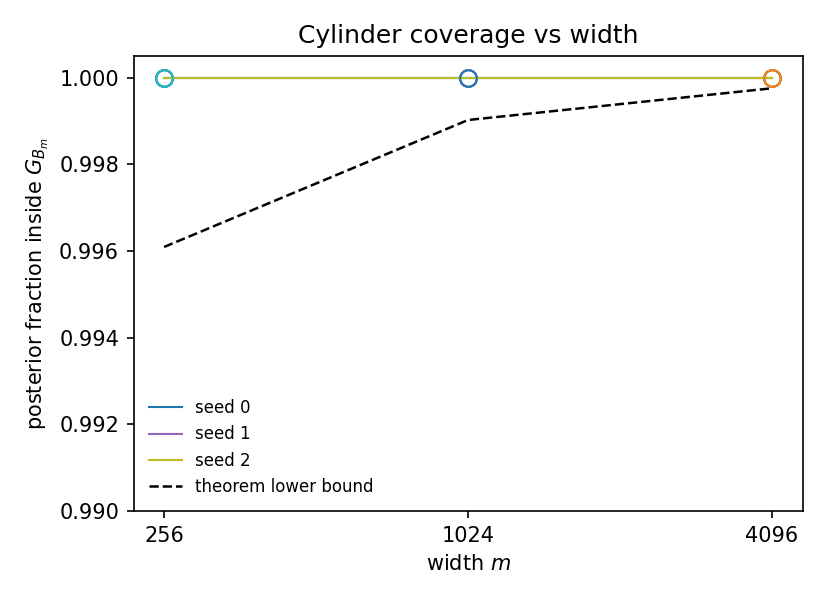
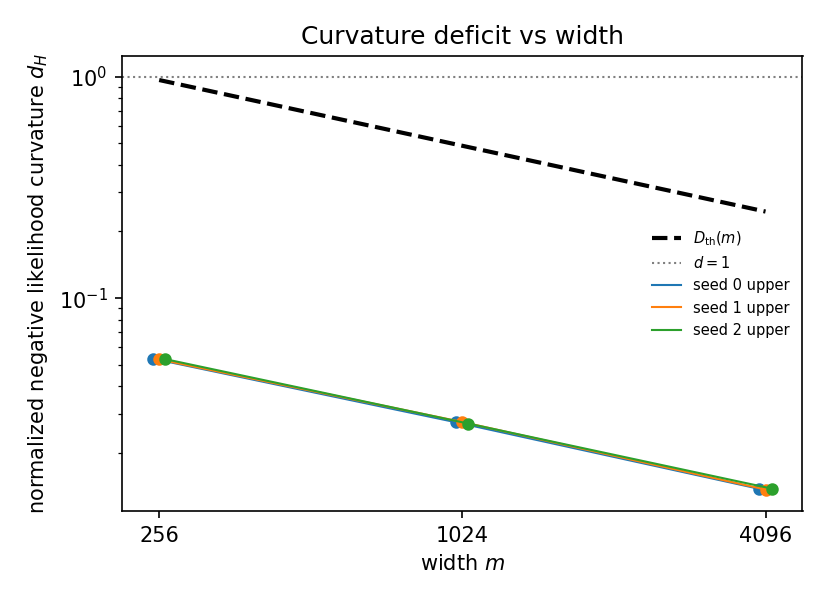
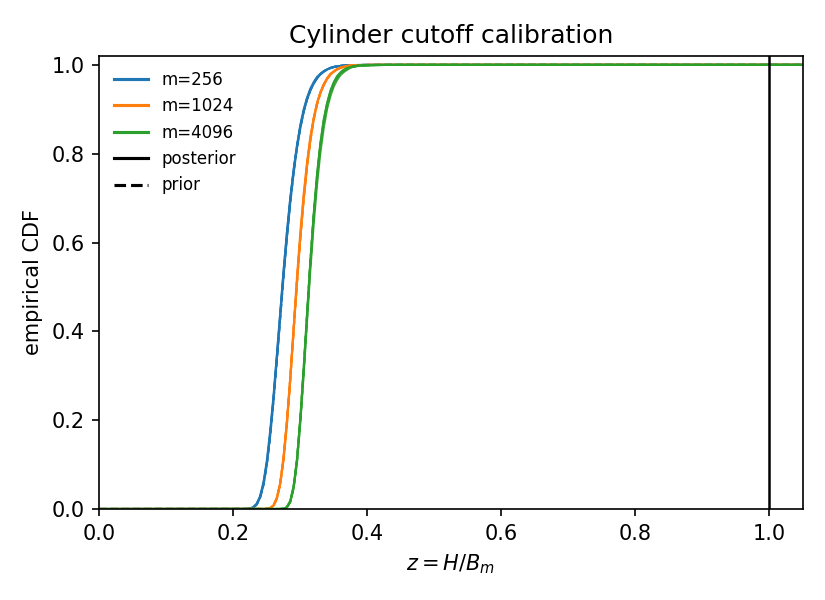
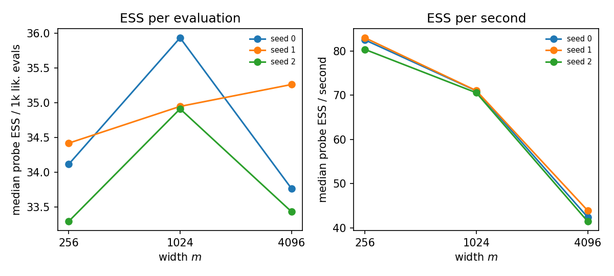

# Cylinder experiment results

Generated 2026-09-27T07:27:25+00:00 on `ccc0312.campuscluster.illinois.edu` (SLURM job 10923946), commit `b3befe9326` (dirty tree), config `config.yaml`.

## Target status

| target | status | T | diag pass | coverage | exits | R̂ max | bulk ESS min | hit budget |
|---|---|---|---|---|---|---|---|---|
| m256_seed0_ess | done | 16000 | True | 1 | 0 | 1 | 3257 | False |
| m256_seed1_ess | done | 8000 | True | 1 | 0 | 1 | 1778 | False |
| m256_seed2_ess | done | 8000 | True | 1 | 0 | 1 | 1772 | False |
| m1024_seed0_ess | done | 4000 | True | 1 | 0 | 1 | 1112 | False |
| m1024_seed1_ess | done | 8000 | True | 1 | 0 | 1 | 1808 | False |
| m1024_seed2_ess | done | 8000 | True | 1 | 0 | 1 | 1804 | False |
| m4096_seed0_ess | done | 8000 | True | 1 | 0 | 1 | 1713 | False |
| m4096_seed1_ess | done | 4000 | True | 1 | 0 | 1 | 1026 | False |
| m4096_seed2_ess | done | 8000 | True | 1 | 0 | 1 | 1774 | False |
| m1024_seed0_pcn | done | 4000 | False | 1 | 0 | 1.01 | 806 | False |

## Theorem checks (ESS targets)

| m | seed | coverage | H/B_m q95 | H/B_m q99 | q95 d₋ | q95 d₊ | D_th | d₊/D_th | E[V] post | E[V] prior |
|---|---|---|---|---|---|---|---|---|---|---|
| 256 | 0 | 1 | 0.3173 | 0.3403 | 0.05212 | 0.0533 | 0.966 | 0.0552 | 20.66 | 23.75 |
| 256 | 1 | 1 | 0.3171 | 0.3405 | 0.05192 | 0.0529 | 0.966 | 0.0548 | 20.73 | 23.75 |
| 256 | 2 | 1 | 0.316 | 0.3407 | 0.05202 | 0.05305 | 0.966 | 0.0549 | 20.67 | 23.75 |
| 1024 | 0 | 1 | 0.3336 | 0.3549 | 0.02713 | 0.0275 | 0.4876 | 0.0564 | 20.82 | 23.73 |
| 1024 | 1 | 1 | 0.3332 | 0.3555 | 0.02727 | 0.02759 | 0.4876 | 0.0566 | 20.7 | 23.77 |
| 1024 | 2 | 1 | 0.3331 | 0.3546 | 0.02677 | 0.02714 | 0.4876 | 0.0557 | 20.73 | 23.78 |
| 4096 | 0 | 1 | 0.347 | 0.3675 | 0.01368 | 0.01377 | 0.246 | 0.056 | 20.62 | 23.74 |
| 4096 | 1 | 1 | 0.3498 | 0.371 | 0.01355 | 0.01367 | 0.246 | 0.0556 | 20.8 | 23.8 |
| 4096 | 2 | 1 | 0.347 | 0.3656 | 0.01371 | 0.01381 | 0.246 | 0.0561 | 20.78 | 23.83 |

## pCN cross-check (m=1024, seed 0)

| quantity | ESS | pCN | diff | combined SE | >3 SE |
|---|---|---|---|---|---|
| H | 2.62061 | 2.62062 | 1.32e-05 | 0.00193 | False |
| H_q95 | 2.94742 | 2.93075 | -0.0167 | | |
| V | 20.8163 | 20.7142 | -0.102 | 0.0183 | True |
| probe_0 | 0.475744 | 0.477989 | 0.00225 | 0.0016 | False |
| probe_1 | 0.502898 | 0.498887 | -0.00401 | 0.00161 | False |
| probe_2 | 0.521185 | 0.519759 | -0.00143 | 0.0016 | False |
| probe_3 | 0.44652 | 0.433652 | -0.0129 | 0.00155 | True |
| probe_4 | 0.505048 | 0.50975 | 0.0047 | 0.00161 | False |
| probe_5 | 0.466313 | 0.471235 | 0.00492 | 0.00158 | True |
| probe_6 | 0.516629 | 0.512025 | -0.0046 | 0.00158 | False |
| probe_7 | 0.513681 | 0.515847 | 0.00217 | 0.00161 | False |

## Figures

